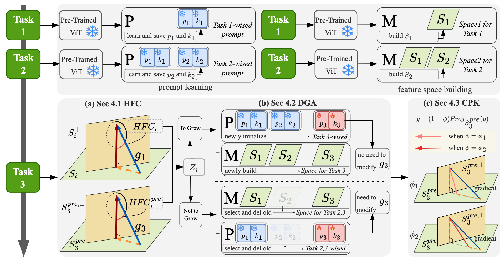

# Method

Caption: 

**Overview of LW2G:** Assume there are already two sets in $\mathcal{P}=\left\{(\bm{p}_1,\bm{k}_1), (\bm{p}_2,\bm{k}_2)\right\}$ and two spaces in $\mathcal{M}=\left\{\mathcal{S}_{1},\mathcal{S}_{2}\right\}$. (a) We use $\mathcal{P}$ and $\mathcal{M}$ to sequentially calculate the HFC on the existing prompt set under the *orthogonal condition* (Sec.4.1). (b) Through a dynamic threshold, we decide whether to grow or not to grow. In the former case, $(\bm{p}_3,\bm{k}_3)$ is **newly initialized** and $\mathcal{S}_{3}$ is **newly built** and there is no need to modify the original gradient; while in the latter case, $(\bm{p}_3,\bm{k}_3)$ is **selected from old** $(\bm{p}_2,\bm{k}_2)$ and $\mathcal{S}_{3}$ is **updated from** $\mathcal{S}_{2}$ ($(\bm{p}_2,\bm{k}_2)$ and $\mathcal{S}_{2}$ will be deleted after learning task $3$) and it is necessary to modify the gradient using the old feature space in $\mathcal{M}$ (Sec.4.2). (c) Control the pre-trained knowledge to be consistent with the downstream task knowledge (Sec.4.3).
